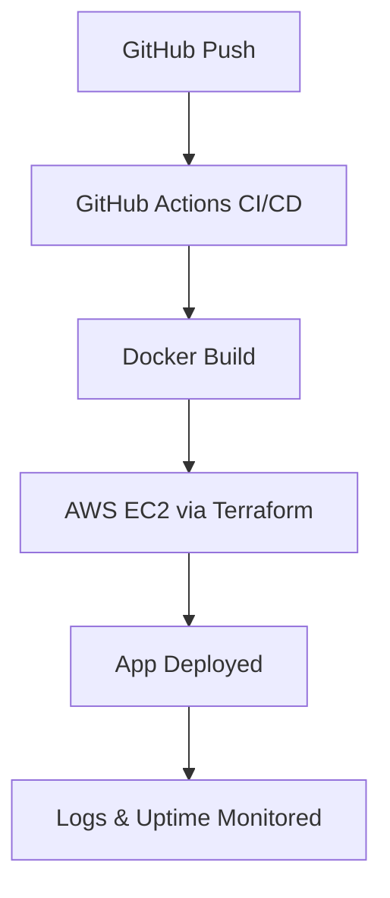

# DevTrack – Cloud-Native DevOps Dashboard

DevTrack is a cloud-native dashboard that enables developers to push code to GitHub, trigger automated deployments to AWS, and monitor deployment status with live logs and uptime checks.

---

## Demo


---

## Features

- Automated deployment of applications from GitHub via GitHub Actions
- Containerized applications using Docker
- AWS deployment (EC2/S3) using Terraform
- Live logs and deployment history in a visual dashboard
- Secrets management via GitHub Actions and AWS IAM

---

## Technology Stack

- **Frontend**: React + Tailwind CSS  
- **Backend**: FastAPI (Python)  
- **CI/CD**: GitHub Actions  
- **Cloud**: AWS EC2, S3, IAM  
- **Infrastructure as Code**: Terraform  
- **Monitoring**: AWS CloudWatch

---

## System Architecture



---

## Getting Started

### Prerequisites

Make sure you have the following installed:

- Docker & Docker Compose
- Terraform CLI
- AWS CLI & AWS Account
- Python 3.10+
- Node.js 18+

### Clone & Run Locally

```bash
# Clone the DevTrack repository
git clone https://github.com/SurinderSinghSaby/DevTrack.git

# Navigate into the project directory
cd DevTrack
```

### Backend (FastAPI)

```bash
cd backend
python -m venv venv
source venv/bin/activate  # On Windows: venv\Scripts\activate
pip install -r requirements.txt
uvicorn main:app --reload
```

### Frontend (React)

```bash
cd frontend
npm install
npm run dev
```

---

## Infrastructure Setup (AWS + Terraform)

```bash
cd infra
terraform init
terraform apply
```

- Provisions EC2 instance, IAM roles, and networking
- Outputs the EC2 public IP for deployment access
- Logs routed to AWS CloudWatch

---

## Deployment (CI/CD)

- GitHub Actions builds and tests Docker images
- Automated deployment to EC2 via SSH or deployment script
- Deployment logs stored in S3 or CloudWatch

---

## Monitoring

- Dashboard displays live deployment logs
- Recent deployments shown in status table
- AWS CloudWatch used for monitoring and alerts

---

## Roadmap

- Add GitHub OAuth login
- Implement rollback on failed deployments
- Add staging and production environments
- Replace EC2 with ECS or AWS Fargate

---

## Author

Built by **Surinder Singh**